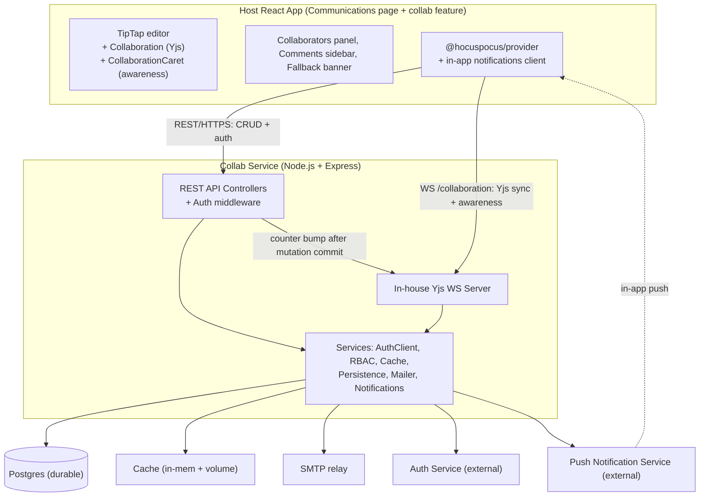
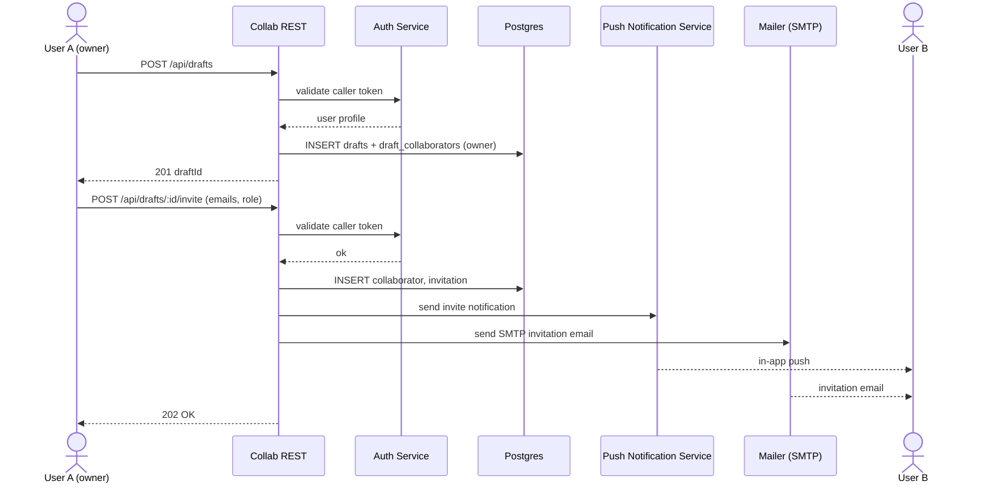
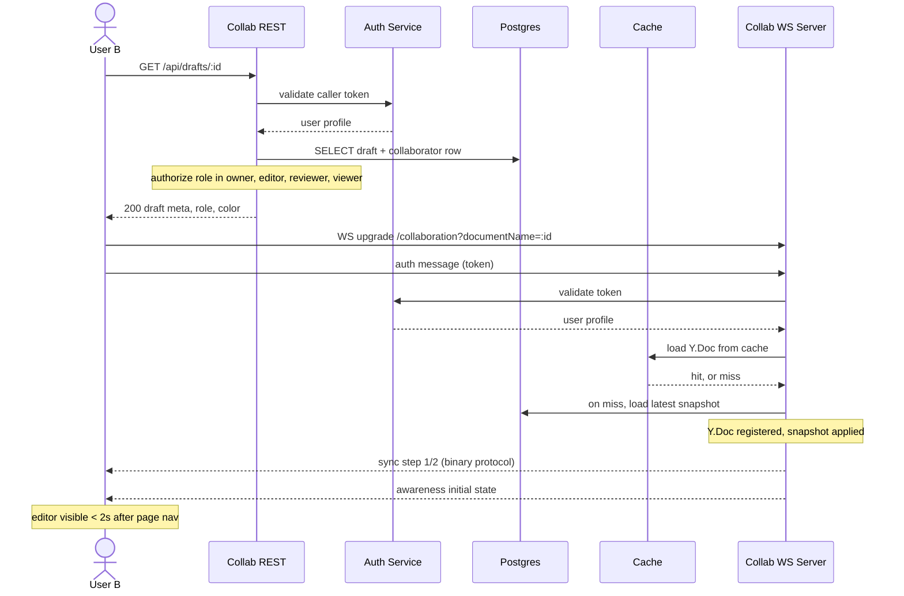
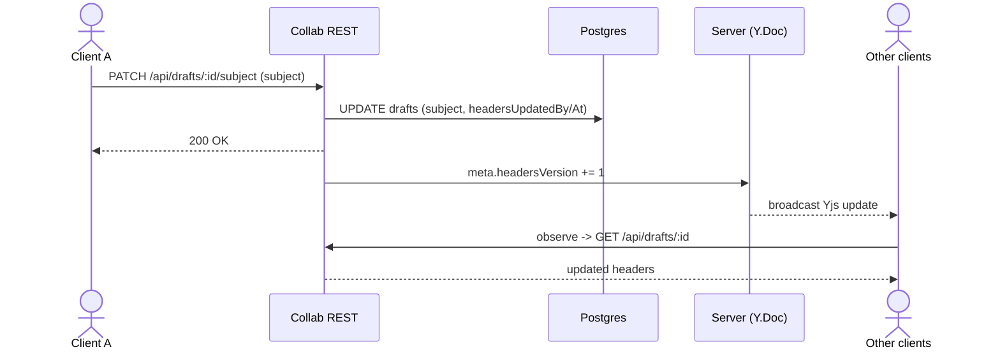
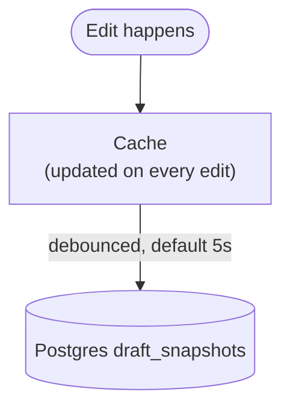
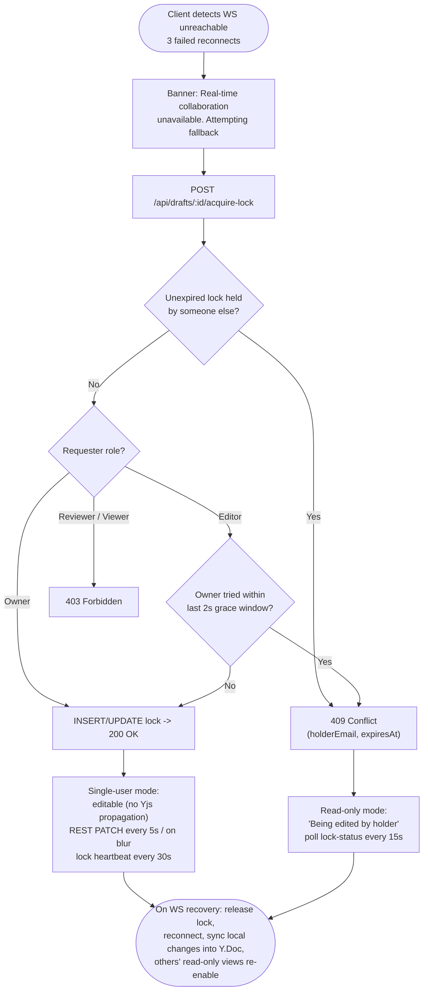
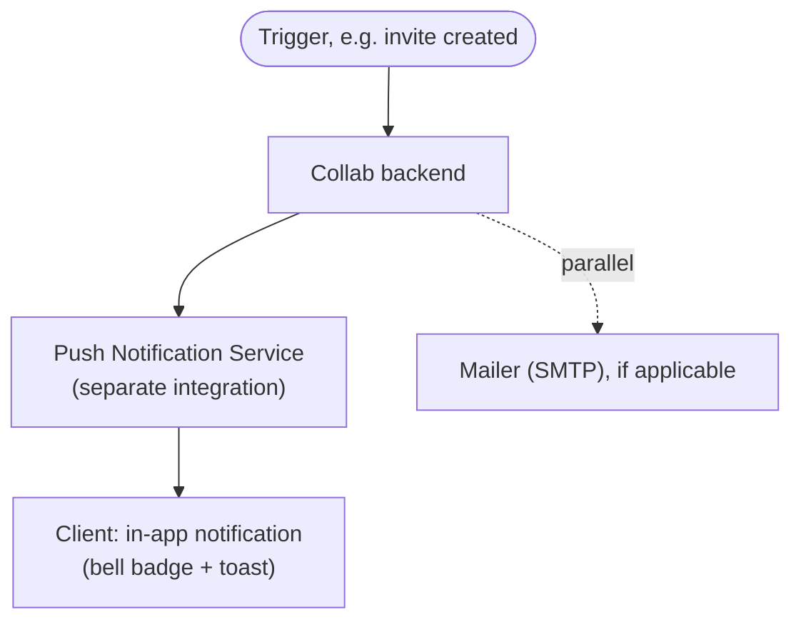

# Collaborative Communication Drafts — Design & Implementation

## 1. Context & Scope

### 1.1 What we're building

The **Communications page** in the host React app currently lets a user compose an email-like communication thread (To, Cc, Subject, Body) with a TipTap rich-text editor, and offers two CTAs: **Save to draft** and **Send**.

This document covers retrofitting that page so that drafts become **multi-user, real-time collaborative artifacts** before being sent:

- The author invites collaborators (with roles) onto a draft.
- Invited collaborators edit the draft simultaneously in real time, with live cursors, presence, selections, comments, and replies.
- The draft auto-saves; **Save to draft is removed**, **Send** remains.
- Recipients get an in-app notification (and optionally an email) when invited.
- Real-time service degradation falls back to a defined single-user mode (see §8.10).

### 1.2 What exists today

| Area | Existing | Reused | New |
| ------ | ---------- | -------- | ----- |
| Communications page (To/Cc/Subject/Body UI) | ✅ | ✅ | Replace single-user editor wiring with collaborative wiring |
| TipTap editor instance | ✅ | ✅ | Add `Collaboration` + `CollaborationCaret` extensions |
| Auth (external auth service) | ✅ | ✅ | Validate tokens by calling the auth service; build our own RBAC table |
| Email send (SMTP) | ✅ | ✅ | Reuse for invitation emails |
| In-app notifications | ❌ | — | Integrate the external Push Notification Service (see §12) |
| Backend collaboration service | ❌ | — | Build (this doc) |

### 1.3 In scope / out of scope

**In scope:** the collab service backend (REST + WS), data model, frontend integration touch-points, in-app notification subsystem, single-user fallback, observability for collab.

**Out of scope:** redesigning the auth service, the existing email-send pipeline (we only reuse it), generalizing collab to other surfaces (post-MVP).

---

## 2. Requirements

### 2.1 Functional

1. **Draft creation.** Any authenticated user can start a communication draft.
2. **Invitations with roles.** Draft owner can invite users by email with one of: `owner`, `editor`, `reviewer`, `viewer`.
3. **RBAC enforcement.** Our service stores collaborator role per draft and enforces authorization on every read/write (REST + WS).
4. **Real-time editing.** Editors can simultaneously edit; conflict-free via CRDT.
5. **Auto-save.** No "Save to draft" button. Server-side debounced persistence at a configurable interval (default 5s).
6. **Active collaborators panel.** Avatar/initials, name, online status for every currently-connected user.
7. **Per-user color.** Each user assigned a stable, distinguishable color for their caret and selection range.
8. **Remote carets.** Render every collaborator's caret with name label at their position in the user's color.
9. **Remote selections.** Render selection range highlight in the collaborator's color.
10. **Idle detection.** After a configurable inactivity period (default 5 min), the user's status flips to `idle` in the panel.
11. **In-app notifications.** When invited, recipient sees an in-app notification with a direct link. Optional email mirror via SMTP.
12. **Inline comments.** Comments on selected text, visible to all collaborators, with reply threading and resolve.
13. **Send.** Owner (or anyone with `editor`+ role, TBD with lead) can finalize and send the draft. After send, draft becomes read-only for all.
14. **Graceful degradation.** When real-time service is unreachable, fall back to defined single-user mode (§8.10).

### 2.2 Non-functional / SLAs

| Category | Target |
| ---------- | -------- |
| Edit propagation latency (P95) | ≤ 500 ms end-to-end |
| Editor page load | ≤ 2 s under normal network |
| Concurrent collaborative sessions across platform | ≥ 100 simultaneous |
| Concurrent editors per draft | ≥ 10 (no upper cap currently specified — see §3 open questions) |
| Collab service uptime | 99.9% |
| Data loss on disconnect / browser crash | Zero (auto-save + reconnect recovery) |
| Real-time outage behavior | Defined single-user fallback with banner |

### 2.3 Constraints

- **Restricted package registry.** `@hocuspocus/provider` and `@hocuspocus/common` are available at **v3.4.3**. `@hocuspocus/server` is **not** available — we implement the server in-house.
- **Hocuspocus v3.4.3 wire protocol.** Server must speak v3-compatible protocol. (v4 wire-compatible too, but v4 brought runtime-portability via `crossws`, not protocol changes that affect us.)
- **Email transport.** SMTP only (no third-party API providers).
- **Cache.** Redis is not yet available. v1 uses **in-process memory + a volume-mounted file cache**. Design the cache behind an interface so Redis can drop in later.
- **Deployment topology.** v1 is single-replica (forced by volume-mount cache). Multi-replica requires Redis or sticky routing — out of scope for v1.

### 2.4 Assumptions (to confirm with lead)

- The backend authenticates every request by calling a **separate auth service** (passing the caller's token); the auth service returns the user's **profile** (stable id/email, display name, and other profile fields). The token format and validation endpoint are owned by that service; our auth middleware is the only place that changes if the contract evolves.
- The host React app uses a known state-management pattern (Redux/Zustand/Context). The collab feature exposes its own hooks; integration with the host store is via a thin adapter the host owns.
- The host app already has an API client (axios/fetch wrapper) with auth-header injection. Collab REST calls go through it.

---

## 3. Open Questions for Review

These need a decision from the lead before or shortly after design approval:

1. **Hard cap on concurrent editors per draft?**
   The requirement floor is ≥10. We recommend a **soft cap of 25, hard cap of 50** per draft. Reasoning: awareness traffic is O(n²); UI noise grows past ~25 carets; Google Docs / Notion settle in this range. No cap means engineering for an unbounded worst case.

2. **Single-user fallback policy (§8.10)?**
   Five policies presented. We recommend **Policy D: owner-first, fall through to first online editor**.

3. **Auth contract.**
   Confirm the auth service's validation contract (endpoint + request/response shape, profile fields returned) the backend will call, plus expected latency so we can cache the profile per connection.

4. **Who can press Send?**
   Owner only, or `editor`+ ?

5. **Notification preferences UI.**
   v1 sends in-app always + email always. Future: per-user preferences. Confirm scope.

6. **Redis arrival timeline.**
   Drives whether multi-replica is in v1.5 or further out.

7. **Snapshot history / audit.**
   v1 keeps only the latest snapshot. Compliance requirements?

---

## 4. Architecture Overview



Durable tables (Postgres): `drafts` (incl. subject/to/cc), `draft_collaborators`, `comments` / `comment_replies`, `draft_snapshots`. Identity is owned by the external **Auth Service**; in-app notification delivery is owned by the external **Push Notification Service** (see §12).

**Note on the internal arrow (REST → Yjs WS Server):** REST controllers handle CRUD mutations (subject/to/cc/comments/invites) and, after the DB transaction commits, call into the in-house Yjs server to bump the relevant `meta.*Version` counter. The Yjs server broadcasts that small update to all connected clients, who then re-fetch via REST. This is the "counter-driven REST mutation" pattern detailed in §8.5.

---

## 5. Why Node.js for the WebSocket Layer

(Justification for choosing Node over the team's primary Python stack.)

1. **The wire protocol is JavaScript-native, and we have its source.** `@hocuspocus/common@3.4.3` (which is in our registry) contains the message-type enums and envelope encoding in TS. In Node we import it; in Python we port it. Adopting Node lets us mirror the protocol from source rather than own a hand-rolled binary implementation.
2. **CRDT runtime parity.** Server and client both use the same `yjs` implementation. `pycrdt` (the Python alternative) is based on `yrs`, a separate Rust impl — small divergences have caused real bugs.
3. **POC reuses cleanly.** The existing POC's auth/persistence/debounce logic ports directly. A Python rewrite re-discovers those edge cases through outages.
4. **WS fan-out is Node's wheelhouse.** Long-lived binary WebSocket connections + event-loop concurrency map perfectly.
5. **Scoped, not a stack shift.** Add **one small Node service**. REST + business logic + auth integration stay in Python where the team is strongest. The team already runs Node services.

Honest counter: two runtimes is more ops surface. We accept that in exchange for eliminating protocol-correctness risk, which is the larger ongoing cost.

---

## 6. Technology Choices Per Layer

### 6.1 Frontend (host React app)

| Concern | Choice | Why |
| --------- | -------- | ----- |
| Editor | **TipTap** (already in app) | Reuse; first-class Yjs integration |
| CRDT runtime | **`yjs`** | Wire format the provider speaks |
| Realtime client | **`@hocuspocus/provider@3.4.3`** | Already in registry; handles sync, awareness, reconnect, exponential backoff |
| Cursors/selections | **`@tiptap/extension-collaboration-caret`** | Renders remote awareness as carets + labels |
| Per-user color | Stable hash of email → curated palette (see §11) | Distinguishable, deterministic |
| Notification client | Push Notification Service client/SDK (platform-provided) | Reuses existing notification infra; no bespoke WS to build |
| Comment UI | Sidebar panel + TipTap mark for highlight anchor | Reuses existing patterns |

### 6.2 Backend

| Concern | Choice | Why |
| --------- | -------- | ----- |
| Runtime | Node.js 20+ (TypeScript) | See §5 |
| HTTP framework | Express 5 + `express-ws` | HTTP + WS on one port/process |
| Yjs WS server | **In-house** using `yjs` + `y-protocols` + `ws` + mirroring `@hocuspocus/common@3.4.3` envelope | `@hocuspocus/server` unavailable; v3 protocol is small and documented in the available TS |
| ORM | Drizzle | Type-safe, lightweight |
| Validation | Zod (shared package) | Same schemas on web + server |
| Logging | Pino | Structured JSON, fast |
| Email | `nodemailer` over SMTP | Reuse existing SMTP infra |
| Auth | Call the external auth service to validate tokens | Single source of truth for identity |
| Rate limit | `express-rate-limit` | Standard |

### 6.3 Storage

| Layer | Choice | Purpose |
| ------- | -------- | --------- |
| Durable | Postgres | All non-CRDT records + draft snapshots |
| Cache (hot) | **In-process `Map<draftId, Y.Doc>`** | Active drafts held in memory while clients connected |
| Cache (warm) | **Volume mount: `/cache/drafts/<draftId>.ybin`** | Survives process restart; one file per draft, atomic write via tmp + rename |
| Cache (later) | Redis | Drop-in replacement for the warm layer when available; required for multi-replica |
| Mail | External SMTP relay | Invitation + optional notification mirror |

---

## 7. Data Model

```ts
// Drizzle-style schema sketch

drafts: {
  id: uuid PK
  ownerEmail: text NOT NULL
  subject: text NOT NULL DEFAULT ''      // last-writer-wins via REST
  to: jsonb NOT NULL DEFAULT '[]'        // EmailEntry[]; set-style add/remove via REST
  cc: jsonb NOT NULL DEFAULT '[]'        // EmailEntry[]
  finalized: boolean DEFAULT false NOT NULL  // true after Send
  finalizedAt: timestamptz
  headersUpdatedBy: text                  // last actor for subject/to/cc (denormalized for fast reads)
  headersUpdatedAt: timestamptz
  createdAt: timestamptz DEFAULT now()
  updatedAt: timestamptz DEFAULT now()
}

draft_collaborators: {
  id: uuid PK
  draftId: uuid FK → drafts.id ON DELETE CASCADE
  email: text NOT NULL
  role: enum('owner', 'editor', 'reviewer', 'viewer') NOT NULL
  color: text NOT NULL              // hex, assigned at insert
  invitedBy: text NOT NULL          // email
  joinedAt: timestamptz
  createdAt: timestamptz DEFAULT now()
  UNIQUE (draftId, email)
}

draft_invitations: {
  id: uuid PK
  draftId: uuid FK
  inviteeEmail: text NOT NULL
  invitedBy: text NOT NULL
  role: enum(...) NOT NULL
  acceptedAt: timestamptz             // null = pending
  createdAt: timestamptz DEFAULT now()
  UNIQUE (draftId, inviteeEmail)
}

draft_snapshots: {
  id: uuid PK
  draftId: uuid FK UNIQUE             // one row per draft, upserted
  state: bytea NOT NULL               // Yjs binary state
  updatedAt: timestamptz
}

draft_locks: {                        // fallback policy support (§8.10)
  draftId: uuid PK
  holderEmail: text NOT NULL
  acquiredAt: timestamptz
  expiresAt: timestamptz NOT NULL     // TTL'd
}

comments: {
  id: uuid PK
  draftId: uuid FK
  content: text NOT NULL
  quotedText: text NOT NULL
  authorEmail: text NOT NULL
  resolved: boolean DEFAULT false
  resolvedBy: text
  createdAt: timestamptz DEFAULT now()
}

comment_replies: {
  id: uuid PK
  commentId: uuid FK
  content: text NOT NULL
  authorEmail: text NOT NULL
  createdAt: timestamptz DEFAULT now()
}

// In-app notifications are owned by the external Push Notification Service
// (storage, unread state, delivery) — see §12 — so no notifications table here.
```

**What lives where:**

| Field | Storage | Real-time strategy | Why |
| ------- | --------- | --------------------- | ----- |
| Body | Yjs `default` (`Y.XmlFragment`) | Native CRDT — character-level merge over WS | Heavily edited by multiple users simultaneously; benefits from char-level conflict-free merge |
| Subject | Postgres `drafts.subject` | REST PATCH + Yjs `meta.headersVersion` counter bump | Short single-line; rarely co-edited; last-writer-wins is fine |
| To | Postgres `drafts.to` (jsonb) | REST PATCH + counter bump | Token-style add/remove, not free text; set semantics avoid conflict entirely |
| Cc | Postgres `drafts.cc` (jsonb) | REST PATCH + counter bump | Same as To |
| Comments + replies | Postgres `comments` / `comment_replies` | REST mutations + Yjs `meta.commentsVersion` counter bump | Relational; benefit from non-collab views (lists, reporting, notifications) |
| Collaborators / RBAC | Postgres `draft_collaborators` | REST | Authorization-critical; needs server enforcement |

**The Yjs doc therefore contains only:**

- `default` — TipTap `Y.XmlFragment` (body content)
- `meta.headersVersion` — integer; bumped by server after a subject/to/cc REST mutation commits
- `meta.commentsVersion` — integer; bumped by server after a comment mutation commits

**Why the counter pattern for headers (not Yjs-native):**

1. **DB schema reuse.** The existing communications/drafts table already stores subject/to/cc as columns. Keeping them there avoids dual-source-of-truth and lets non-collab views (list pages, send pipeline, search) read without touching Yjs.
2. **Low edit frequency.** These fields are edited rarely compared to the body; the small UI lag from "REST PATCH → version bump → other clients refetch" (~100-300ms) is invisible in practice.
3. **No CRDT merge complexity.** For discrete set-style fields (to/cc) and a single-line string (subject), last-writer-wins via PATCH is semantically correct and simpler than modeling them as `Y.Array` / `Y.Text`.

**Trade-off accepted:** subject loses character-level live editing (no seeing other users type a letter at a time). Mitigation: PATCH the subject on blur, or debounce while typing (250ms). For email subjects this is the right trade.

---

## 8. Core Flows

### 8.1 Create draft and invite



### 8.2 User B opens the draft



### 8.3 Live edit propagation

```mermaid
sequenceDiagram
    actor A as User A
    participant WS as Collab WS Server
    participant Store as Cache + DB
    actor B as User B

    Note over A: types "h" -> TipTap -> Yjs update (binary, tens of bytes)
    A->>WS: sync update over WS
    WS->>WS: apply to server Y.Doc
    WS->>Store: write to cache; debounce DB flush (default 5s)
    WS-->>B: broadcast update to other conns (excl. sender)
    Note over B: provider applies to local Y.Doc -> TipTap re-renders
    Note over A,B: P95 round trip well under 500ms
```

### 8.4 Awareness (cursors, selections, presence)

- Each client sets awareness state on its provider: `{ user: {email, name, color}, cursor: {anchor, head}, status: 'active' | 'idle' }`.
- Awareness is broadcast independently of doc updates via `y-protocols/awareness`.
- **Awareness is NOT persisted** — it's ephemeral broadcast only. When a client disconnects, their awareness entry expires (TTL handled by the protocol).
- Remote carets are rendered by `@tiptap/extension-collaboration-caret`, which reads from the provider's awareness state.
- **Idle detection:** client-side timer on `document` user-input events. After N minutes (default 5) of no input, set awareness `status: 'idle'`. Other clients observe and re-render the panel.

### 8.5 Counter-driven REST mutations (shared pattern: comments AND headers)

A unified pattern is used for any data that lives in Postgres but needs real-time fan-out to connected clients. Two instances of this pattern exist:

- **Comments** — `meta.commentsVersion` signals "refetch the comments list"
- **Headers (subject/to/cc)** — `meta.headersVersion` signals "refetch the draft headers"

**The pattern:**

1. Client issues REST mutation (`POST /api/comments`, `PATCH /api/drafts/:id/subject`, etc.).
2. Server validates, authorizes, writes to Postgres.
3. After commit, server bumps the relevant version counter in the in-memory `Y.Doc` (`meta.commentsVersion += 1` or `meta.headersVersion += 1`).
4. Yjs broadcasts that small update to all connected clients over WS.
5. Each client observes the counter change and re-fetches via REST.

**Why the server bumps the counter (not the client):**

In the POC, the client did the bump after the REST call returned. That left a race: REST commits, then the client crashes before sending the Yjs update, and other clients never refresh until next reconnect. Moving the bump server-side eliminates the race and ensures the counter is updated exactly once per committed mutation.

**Concrete sequence — subject change** (comments and to/cc are mechanically identical, just a different endpoint and counter):



**Endpoint shapes:**

- `PATCH /api/drafts/:id/subject` — body `{ subject: string }` — last-writer-wins
- `PATCH /api/drafts/:id/to` and `/cc` — body `{ add?: EmailEntry[], remove?: EmailEntry[] }` — set semantics so concurrent add+remove don't trample each other
- `POST /api/comments`, `POST /api/comments/reply`, `PATCH /api/comments/resolve` — as in the POC

### 8.6 Auto-save & persistence layering

Three tiers, two write paths:



- Cache write is **synchronous on every edit** (fast; no debounce).
- DB flush is **debounced**; clears on shutdown via graceful flush handler.
- On startup / first client connection: load Y.Doc state from cache, falling back to the latest DB snapshot.

### 8.7 Reconnect & recovery

Provider handles reconnect with exponential backoff automatically. Server-side behavior:

1. Client WS disconnect → server keeps Y.Doc in memory for a **grace period** (default 60s). Other clients still connected keep it alive.
2. If all clients disconnect → after grace period, flush pending DB write and evict Y.Doc from memory. Volume file remains.
3. On any client reconnect → repeat §8.2 load path.
4. Client's local Yjs state is preserved across reconnect; sync step 2 replays missed updates in both directions.

**Browser crash recovery:** Yjs CRDT properties mean as long as the client's local updates reached the server before the crash, no data is lost. For the rare edge case of edits in flight at crash time, mitigations:

- WS frames flush in <50ms typically; in-flight loss is sub-keystroke-frequency.
- Add `pagehide`/`beforeunload` handler that calls `provider.flush()` synchronously before the page tears down.

### 8.8 Send

- `POST /api/drafts/:id/send` (must be owner — confirm with lead).
- Server: validates draft is not already finalized, reads current Yjs state to extract subject/to/cc/body, hands off to existing email-send pipeline.
- On success: `UPDATE drafts SET finalized=true, finalizedAt=now()`.
- WS connections for this draft are notified; all clients enter read-only.
- Notify all collaborators (`draft_sent`) via the Push Notification Service.

### 8.9 In-app notifications

Delivered by the external **Push Notification Service** (see §12). From the user's perspective:

- Bell icon in the host app's chrome shows the unread count.
- Click → list of recent notifications with deep links.
- New notifications update the badge in real time via the notification service's client.

### 8.10 Single-user fallback (5 policies + recommendation)

**Trigger:** client detects real-time service unavailable. Concrete signal: `N` consecutive WS connection failures (default `N=3`, exponential backoff) OR a `503` from a server health probe.

**Policy options:**

| Policy | Who gets to edit during outage | Pros | Cons |
| -------- | ------------------------------- | ------ | ------ |
| **A. Owner-only** | Draft creator only | Simplest rule; matches "my draft" mental model | If owner is offline, no one can edit during the outage |
| **B. First-come, first-served** | First user to acquire lock via REST | Simple, fair, no role logic | Race conditions on simultaneous outage; lock holder decided by luck |
| **C. Highest role wins, tie-break by FCFS** | Owner > Editor; ties broken by REST timestamp | Aligns with RBAC | Still blocks if highest-role user is offline |
| **D. Owner-first, fall through to first online editor** ⭐ | Owner if online; else first editor to claim after a short grace window | Owner gets implicit priority; team unblocked if owner away | Slight implementation complexity (grace window) |
| **E. Last-active editor wins** | Whoever was actively typing in last N seconds | Zero contention (they were already typing) | Requires tracking last-edit timestamp; ambiguous if no recent activity |

**Recommended: Policy D.**

**Implementation of Policy D:**



**Merge consideration on recovery:** the single-user mode edits are plain content changes. When WS recovers, the client constructs a Yjs delta from "last known synced state" → "current local state" and applies it. Because the holder was the only writer during outage, no conflicts.

### 8.11 Notification delivery flow



Offline recipients are handled by the Push Notification Service (it stores unread notifications and surfaces them on next login) — the collab backend just emits the event.

---

## 9. RBAC Model

| Role | Read draft | Edit content | Comment | Reply | Resolve | Invite | Send | Remove collaborator |
| ------ | :---: | :---: | :---: | :---: | :---: | :---: | :---: | :---: |
| owner | ✓ | ✓ | ✓ | ✓ | ✓ | ✓ | ✓ | ✓ |
| editor | ✓ | ✓ | ✓ | ✓ | ✓ | — | ?¹ | — |
| reviewer | ✓ | — | ✓ | ✓ | — | — | — | — |
| viewer | ✓ | — | — | — | — | — | — | — |

¹ Send permission for editors is an open question (§3.4).

**Enforcement points:**

1. **REST middleware** — every mutating endpoint runs `authenticate` (validate token via the auth service) then `authorize(draftId, requiredRole)` (RBAC).
2. **WS auth handshake** — connection request includes the auth token; server validates it via the auth service, looks up collaborator row, attaches `{ email, role, color }` to connection context.
3. **WS read-only enforcement** — if role ∈ {viewer, reviewer} OR draft is finalized, the connection is marked `readOnly`; inbound sync update messages are dropped server-side (the connection still receives broadcasts).
4. **Send action** — explicit role check at the controller before invoking the existing email pipeline.

**Finalized drafts are read-only for everyone**, including the owner.

---

## 10. In-House Yjs WebSocket Server — Implementation

### 10.1 Module structure

```text
apps/server/src/collab/
  protocol/
    messages.ts        // Mirrors @hocuspocus/common@3.4.3 MessageType enum + encoding
    sync.ts            // Wraps y-protocols/sync (step1/step2/update messages)
    awareness.ts       // Wraps y-protocols/awareness
    auth.ts            // Server side of v3 auth handshake
  registry.ts          // Map<draftId, DocumentEntry> — Y.Doc instance + connection set
  connection.ts        // Per-WS Connection class: read-only flag, user context, message router
  server.ts            // Top-level wireup; accepts WS upgrade, handles lifecycle
  persistence.ts       // Bridge: Y.Doc 'update' event → cache write + debounced DB flush
  cache/
    interface.ts       // CacheAdapter { get(id): Promise<Buffer|null>; set(id, Buffer); delete(id) }
    in-memory.ts       // Hot tier
    volume.ts          // Volume-mount file impl with atomic write (tmp+rename, fsync)
    redis.ts           // Future Redis impl (interface-compatible)
```

### 10.2 Protocol implementation notes

Read `@hocuspocus/common@3.4.3` source for ground truth. v3 protocol surface:

- **Inbound message types** (from client to server): `Auth`, `Sync` (step 1, step 2, update sub-types), `Awareness`, `QueryAwareness`, `Stateless` (custom RPC, can ignore for v1), `BroadcastStateless`, `Close`, `SyncReply`, `SyncStatus`.
- **Outbound message types** (server to client): `Auth` (ack), `Sync`, `Awareness`, `Stateless`, `SyncStatus`.
- **Framing:** every message starts with a varint message-type tag and a document name (UTF-8 string), then a payload whose encoding depends on message type.
- **Sync sub-protocol** is `y-protocols/sync` verbatim — we don't reimplement, we use it.
- **Awareness sub-protocol** is `y-protocols/awareness` verbatim.
- **What we implement ourselves:** the Hocuspocus message-type tag + document-name wrapping, plus the auth handshake.

### 10.3 Auth handshake (v3)

1. Client opens WS with `?documentName=<draftId>`.
2. Server accepts upgrade.
3. Client sends `MessageType.Auth` with token payload.
4. Server: validates the token by calling the auth service, extracts email, fetches collaborator row, decides read-only.
5. Server sends `MessageType.Auth` with success/failure.
6. On success: server begins sync step 1 by sending its current Y.Doc state vector; sync proceeds.

### 10.4 Connection lifecycle

```text
upgrade
  ↓
new Connection(ws, draftId)
  ↓
receive Auth message → verify → either Close (failure) or proceed
  ↓
add to registry's connection set for draftId; load Y.Doc if first
  ↓
send sync step 1
  ↓
loop: dispatch incoming messages by type
  ↓
on close: remove from set; if set empty, start grace timer
on grace expire: flush pending DB write, evict Y.Doc
```

### 10.5 Read-only enforcement

For connections marked read-only:

- Inbound `Sync` update messages: silently drop (do not apply, do not broadcast).
- Inbound `Awareness` messages: still accepted (so reviewers/viewers appear in the collaborators panel and their cursors can be shown).
- Outbound: receive all broadcasts normally.

### 10.6 Shutdown drain

SIGTERM / SIGINT → stop accepting new connections → for each entry in registry: flush pending debounce timer immediately → wait for all flushes → process.exit(0).

---

## 11. Frontend Integration

### 11.1 React components to add

```text
components/communications/collab/
  CollabDraftEditor.tsx          // Wraps existing TipTap editor with collab extensions
  CollaboratorsPanel.tsx          // Avatar list with online/idle status
  CommentSidebar.tsx              // Inline comments + replies
  FallbackBanner.tsx              // Renders during outage / read-only
  RemoteCaret.tsx                 // (provided by CollaborationCaret extension; styling override)
```

### 11.2 Hooks

```text
hooks/collab/
  useCollabProvider.ts            // Builds HocuspocusProvider, manages lifecycle, exposes status
  useDraftAwareness.ts            // Sets local user awareness; observes others
  useIdleDetection.ts             // Tracks idle timer, updates awareness status
  useDraftComments.ts             // List + mutations + version-counter observer
  useFallbackController.ts        // WS status → lock acquire/release → mode flag
```

### 11.3 Integration touch-points the host app must provide

- **Auth token getter:** `() => Promise<string>` returning a valid auth token (issued by the auth service). Used by REST client and the WS provider's auth message.
- **Current user info:** `{ email, displayName }` for awareness state.
- **API base URL** and **WS base URL** from env config.
- **Mount point:** the Communications page replaces its `<TipTapEditor draft={draft} />` with `<CollabDraftEditor draftId={draft.id} />`.
- **Notification chrome:** the host app's existing notification bell consumes the Push Notification Service; the collab feature only emits events to that service.

### 11.4 Per-user color assignment

- A curated palette of ~16 high-contrast colors (avoiding red-green collision for accessibility).
- Color is assigned at `draft_collaborators` row creation, deterministic and stable.
- Algorithm: `hash(email) % palette.length`, then if collision with another collaborator on the same draft, walk forward to next free slot. Persisted in `draft_collaborators.color`.

---

## 12. In-App Notifications (External Push Notification Service)

In-app notification delivery is **not built in-house** — the collab backend integrates with a **separate Push Notification Service** (the same way it integrates with the auth service and SMTP relay). This keeps the collab service focused on collaboration and reuses the platform's existing notification infrastructure (delivery, per-user fan-out, unread state, the bell UI feed).

### 12.1 Responsibilities

| Concern | Owner |
| --------- | ------- |
| Trigger a notification (invite, comment, draft sent) | **Collab backend** — calls the Push Notification Service with `{ recipient, type, payload }` |
| Real-time delivery to connected clients | **Push Notification Service** |
| Storage + unread/read state + history | **Push Notification Service** |
| In-app bell UI (badge, list) | **Host app**, fed by the Push Notification Service client |
| Optional email mirror | **Collab backend** via the SMTP relay (for invites / draft-sent) |

### 12.2 Integration points

- A thin `Notifications` service in the collab backend wraps the Push Notification Service client; controllers call it after the relevant DB mutation commits (e.g. invite created).
- The host app already renders the platform notification bell; we only emit events to the service — no per-user WebSocket, store, or `/api/notifications` endpoint to build here.
- Contract to confirm with the platform team: the service's "send notification" API shape and the client/SDK the host app uses to subscribe.

---

## 13. SLA & Capacity Sizing

### 13.1 Latency (≤500ms P95)

**Path:** client A keystroke → TipTap → Yjs transaction → WS send → server apply → broadcast → client B WS recv → Yjs apply → TipTap re-render.

- Yjs encode/decode: sub-millisecond.
- WS send: tens of ms typical on the open internet.
- Server apply + broadcast: sub-millisecond.
- Render: sub-frame (16ms).

**Total expected P95: 50-200ms on normal networks.** 500ms target has comfortable headroom. The only thing that blows it: network egregious, server CPU-pegged, or pathological doc size.

### 13.2 Page load (≤2s)

Critical-path: route load → REST `/api/drafts/:id` → WS handshake → sync step 1/2 → first paint.

- Initial REST + auth: ~100ms.
- WS handshake + auth message round trip: ~50-100ms.
- Sync step 1/2 with snapshot (~10s of KB for a typical draft): ~20-50ms.
- TipTap mount + render: ~100-300ms.

**Expected total: 500ms-1s in steady state.** Cold-start backend (Y.Doc not in cache) adds DB read (~20ms). Well within 2s.

### 13.3 Concurrency (≥100 sessions × 10 editors = ~1,000 concurrent WS)

**One Node process** can comfortably handle 1,000 WS connections. Memory budget: each Y.Doc ~tens of KB (depends on content size and update history); 100 drafts × 50KB = ~5MB cached docs. Negligible.

**Bandwidth:** awareness state ~100 bytes per user; updates ~tens of bytes per keystroke. At 10 editors typing simultaneously in one doc, broadcast amplification = 10 × 9 = 90 messages, still trivial.

**CPU:** Yjs apply is cheap; the v8 event loop is the bottleneck only if doc updates pile up. None of our flows are CPU-bound.

**Conclusion:** single-replica meets stated SLAs with substantial headroom. We must scale horizontally when:

- More than ~5,000 concurrent WS connections (Node starts feeling it), OR
- We need cross-region failover, OR
- We need rolling deploys without disconnecting users (multi-replica with drain).

Each of those triggers requires Redis (for shared cache + pub/sub) and either sticky routing per draft or a session-affinity layer.

### 13.4 99.9% uptime

99.9% = ~43 minutes downtime/month. Achievable with single-replica + good monitoring + fast restart, but multi-replica with rolling deploys is a meaningfully easier path. For v1 single-replica:

- Health check endpoint with realistic checks (DB ping, cache write).
- Process supervisor (systemd / PM2 / k8s liveness) restarts on crash.
- Volume-mount cache survives restart → reconnects re-sync within seconds.
- Plan downtime windows for deploys, OR accept a few seconds of WS disconnection that the provider auto-recovers from.

---

## 14. Observability

- **Structured logs** (Pino) with consistent fields: `requestId`, `draftId`, `userEmail`, `component`.
- **Metrics to expose** (Prometheus-style or whatever the env standardizes on):
  - `collab.connections.active{draftId}` — gauge
  - `collab.docs.loaded` — gauge
  - `collab.updates.received` — counter
  - `collab.broadcast.latency` — histogram
  - `collab.db.flush.latency` — histogram
  - `collab.cache.{hit,miss}` — counter
  - `notifications.delivered{channel}` — counter
- **Health checks:** `/health` (liveness, always 200 if process up); `/ready` (DB + cache writeable).
- **Alerts:**
  - 5xx rate on collab REST > 1% for 5 min
  - WS handshake failure rate > 5% for 5 min
  - DB flush errors > 0 in any 1-min window
  - Cache write failure rate > 0.1%
  - Active doc count >> expected (potential leak)

---

## 15. Failure Modes & Recovery

| Failure | Behavior | Recovery |
| --------- | ---------- | ---------- |
| Cache (volume) unavailable | Falls through to DB on read; writes fail loudly | Alert; restart on healthy node |
| DB unavailable | Edits keep flowing through WS; flushes queue and retry; clients see no impact short-term | Alert; queue drains when DB recovers |
| Server pod crash | Active clients see WS drop; provider reconnects with exp backoff | State recovered from cache (memory was lost; volume survives) or DB; clients re-sync local state |
| Volume wiped on pod replacement | Falls back to DB snapshot; ≤5s of edits may be lost since last flush, but clients re-sync their local state on reconnect → no actual loss | Reconnect path handles automatically |
| External auth service down | Token validation calls fail on new connections; existing WS sessions unaffected | Surface 503 on new connects; degrade gracefully |
| SMTP relay down | Invitation email send fails; in-app notification still works | Retry queue (out of scope for v1?); confirm with lead |
| Provider/server protocol skew | Pin provider to 3.4.3; contract test suite drives real provider against server in CI | Caught at PR time, not in prod |

---

## 16. Migration & Rollout

- **Feature flag** on the Communications page: `collabDraftsEnabled`. Off by default.
- **Backfill:** none required — collab feature applies only to drafts created after the feature is enabled. Pre-existing drafts continue as single-user.
- **Rollout stages:**
  1. Internal users only.
  2. Opt-in beta cohort.
  3. GA.
- **Rollback path:** flag off → page reverts to old single-user editor. Server can stay deployed; just unused.

---

## 17. Open Implementation Decisions / Future Work

- **Multi-replica + Redis** (when traffic or availability needs justify).
- **Snapshot history** — append-only updates table + periodic compaction; needed if audit/undo-across-sessions becomes a requirement.
- **Comment anchoring via Yjs relative positions** — survives edits to surrounding text; v1 stores `quotedText` only.
- **Server-driven RPC for collaborator changes** — currently REST polled; could move to a `Stateless` Hocuspocus message for live "Alice was added" updates.
- **Per-user notification preferences UI.**
- **Lock TTL & abandonment recovery for fallback policy D** — if a lock holder crashes mid-edit during outage, the TTL releases the lock; next claimant inherits the draft as-of-last-saved-state, with up to 5s of lost edits.
- **Send permission scope** — owner-only vs editor+.
- **Rate limits per draft** (cap edits/sec, awareness/sec) to protect against runaway clients.

---

## Appendix A — Glossary

- **Y.Doc** — a Yjs document instance; the CRDT root holding shared types.
- **Awareness** — ephemeral per-client state (cursor, presence) broadcast separately from doc updates.
- **Provider** — the client library (`@hocuspocus/provider`) bridging a local Y.Doc to the server over WS.
- **Sync step 1 / 2** — Yjs's two-phase initial sync handshake: exchange state vectors, then exchange missing updates.
- **Snapshot** — a single binary blob from `Y.encodeStateAsUpdate(doc)` representing the full doc state at a point in time.
