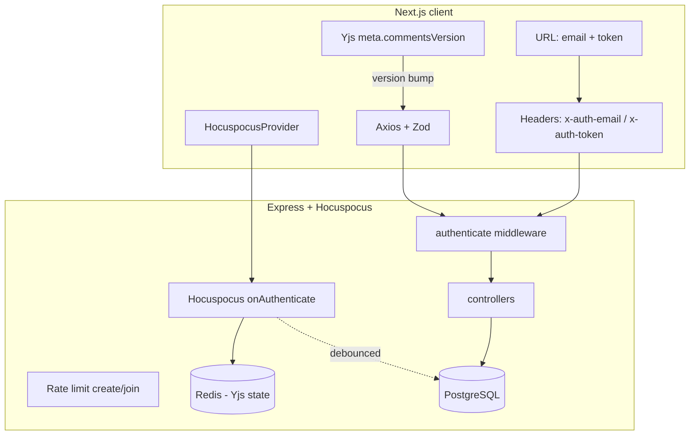

# Collaborative Document Editor

A real-time multi-user collaborative document editor built as a demo with production-level code. Think Google Docs — multiple users editing simultaneously with live cursors, comments, and role-based access control.

## Tech Stack

### Monorepo

- **Turborepo** — build orchestration
- **pnpm** — package manager
- **Biome** — formatting and linting
- **TypeScript** — strict mode across all packages

### Frontend (`apps/web`)

- **Next.js 16** with Turbopack
- **Tiptap v3** — rich text editor (with a custom `comment-mark` extension)
- **Yjs** + **@hocuspocus/provider** — real-time collaboration (CRDT)
- **Tailwind CSS v4** + **shadcn/ui** — styling and components
- **next-themes** — light/dark theme switching with View Transitions API animation
- **React Hook Form** + **Zod v4** — form management and validation
- **Axios** — type-safe API client with Zod response validation
- **nextjs-toploader** — page loading progress bar
- **Sonner** — toast notifications

### Backend (`apps/server`)

- **Express 5** — HTTP server
- **Hocuspocus v4** — WebSocket collaboration server
- **Drizzle ORM** + **PostgreSQL** — database
- **Redis** — primary store for real-time document state with periodic DB flushes
- **Resend** — transactional invite emails
- **Pino** + `pino-http` — structured logger with HTTP request/response logging (pretty-printed in dev via `pino-pretty`)
- **envalid** — type-safe environment variables
- **express-ws** — WebSocket support for Express

### Shared (`packages/shared`)

- Zod schemas for all request/response types
- Role definitions, color palette, constants
- Shared TypeScript types inferred from schemas

## Features

### Real-time Collaboration

- Live document editing with CRDT conflict resolution (Yjs)
- Colored cursors showing where other users are editing
- Text selection highlighting visible to all collaborators
- Connection status indicator (green dot when WebSocket is active)

### Role-Based Access Control (RBAC)

The four roles — owner, editor, reviewer, viewer — gate every action in the app. Both the REST API (per-route checks) and the Yjs WebSocket (`readOnly` connection flag) enforce these permissions.

| Action                          | Owner | Editor | Reviewer | Viewer |
| ------------------------------- | :---: | :----: | :------: | :----: |
| View document                   |  ✅   |   ✅   |    ✅    |   ✅   |
| See collaborators / presence    |  ✅   |   ✅   |    ✅    |   ✅   |
| Edit document body              |  ✅   |   ✅   |    ❌    |   ❌   |
| Edit document title             |  ✅   |   ✅   |    ❌    |   ❌   |
| Add / reply to comments         |  ✅   |   ✅   |    ✅    |   ❌   |
| Resolve / reopen comments       |  ✅   |   ✅   |    ✅    |   ❌   |
| Anchor comment marks in editor* |  ✅   |   ✅   |    ❌    |   ❌   |
| Invite users                    |  ✅   |   ✅   |    ❌    |   ❌   |
| Change a collaborator's role    |  ✅   |   ❌   |    ❌    |   ❌   |
| Remove a collaborator           |  ✅   |   ❌   |    ❌    |   ❌   |
| Finalise / reopen document      |  ✅   |   ✅   |    ❌    |   ❌   |

\* Reviewers can post comments via REST but their WebSocket is read-only, so the inline underline mark only gets applied when an editor/owner posts a comment.

Additional rules baked into the API:

- An owner cannot demote themselves, remove themselves, or change their own role
- The sole remaining owner cannot be demoted (would leave the doc without an owner)
- Owners cannot be removed by anyone (they must demote first or be demoted by another owner)
- Owners can only be assigned at document-creation time — there is no API path to promote a collaborator to owner

### Finalising a document

Owners and editors can **finalise** a document when changes are complete. While finalised:

- The document becomes read-only over the WebSocket for **everyone**, including the owner
- Title edits, comment add/reply/resolve, and document-body edits all return `409 Conflict` from the API
- The connection status indicator in the header switches to **"Finalised"** (blue dot)
- All open WebSocket connections are force-reconnected so the read-only flag takes effect immediately

Finalise is reversible — any owner or editor can reopen the document at any time.

### Document Title

- Editable title in the document header (hover the title to reveal the pencil icon)
- Click pencil to switch to an inline input; Enter saves, Esc cancels
- New title broadcasts via Yjs `meta.title` — all connected clients see the change instantly
- Persisted to Postgres so cold loads see the latest title

### Comments

- Select text and add comments (creates a thread linked to the quoted text)
- Reply to existing comment threads
- Resolve and reopen comments
- **Inline comment marks**: when an owner/editor posts a comment, the selected text is underlined in the commenter's collaborator color via a custom Tiptap mark that syncs through Yjs and persists with the document state
- Resolving a comment removes the inline mark
- Comments are persisted to Postgres and synced in real-time via a Yjs version counter (no polling)

### Theming

- Built-in light and dark themes (default: dark) powered by `next-themes`
- Theme toggle on the homepage and document header
- Smooth view-transition animation between themes (slides the new theme down from the top, gracefully falls back if `View Transitions API` or `prefers-reduced-motion` aren't available)
- All overlays (tooltips, dialogs, popovers, hover cards, toasts) use a glass-morphism style (`backdrop-blur` + translucent popover background) that adapts to the active theme

### Collaborator Management

- **Role manager** (owner-only): change a collaborator's role between editor, reviewer, and viewer via a dropdown
- **Remove collaborator** (owner-only): trash icon next to each collaborator in the manage dialog
- Real-time propagation: invite, role change, and removal all bump a Yjs `meta.collaboratorsVersion` counter; every connected client immediately refetches its collaborator list and updates the UI
- Demotion is reactive — if you're demoted from editor to viewer mid-session, the editor flips to read-only and the comment composer disappears without a refresh

### User Presence

- Avatars in the header showing active collaborators
- First 2 shown individually, rest collapsed into a `+N` avatar
- Each user gets a unique color (persisted per document, doesn't change across sessions)
- Avatars grey out after 5 minutes of inactivity
- Hover to see email, role, and active/inactive status

### Invitations

- Share button opens a dialog with a field array (add multiple invitees at once)
- Each invite has an email field and a role selector (editor/reviewer/viewer)
- Toggle to send/skip the actual email (useful for local testing)
- Invited users receive an email via Resend with a direct link to the document
- Link format: `/{documentId}?email=abc@email.com&token=123456`

### Authentication (URL-based)

- No session management — identity is driven entirely by URL parameters
- Document token is a 6-character code shared by all collaborators of a document
- Easy to test multiple users by opening different tabs with different email params
- Join flow validates credentials on form submission and again on page load (SSR)

## Project Structure

```text
├── apps/
│   ├── web/                    Next.js frontend
│   │   ├── app/
│   │   │   ├── page.tsx            Homepage (create/join)
│   │   │   ├── error.tsx           Global error boundary
│   │   │   ├── not-found.tsx       Global 404
│   │   │   └── [documentId]/       Document editor page + per-doc error/404
│   │   ├── components/
│   │   │   ├── ui/                 shadcn components (CLI-managed)
│   │   │   ├── home/               Homepage forms
│   │   │   ├── document/           Editor, toolbar, comments, header,
│   │   │   │   ├── extensions/     Custom Tiptap extensions (comment-mark)
│   │   │   │   └── ...
│   │   │   ├── theme-provider.tsx  next-themes wrapper
│   │   │   └── theme-toggle.tsx    View-transition theme switcher
│   │   ├── hooks/                  Custom hooks (useCommentsSync, useActiveUsers)
│   │   ├── lib/                    API client, routes, utils
│   │   └── env.ts                  Type-safe env (t3-env)
│   └── server/                 Express + Hocuspocus backend
│       ├── src/
│       │   ├── controllers/
│       │   │   ├── documents/      create, join, get, invite, update-role,
│       │   │   │                   update-title, remove-collaborator, finalize
│       │   │   └── comments/       list, create, reply, resolve
│       │   ├── services/           External integrations (Redis, Resend, Pino logger)
│       │   ├── utils/              Shared helpers (auth, email norm, document status)
│       │   ├── middleware/         authenticate, validate
│       │   ├── routes/             Thin route wiring (middleware → controller)
│       │   ├── db/                 Drizzle schema and client
│       │   ├── hocuspocus.ts       WebSocket collaboration server
│       │   └── env.ts             Type-safe env (envalid)
│       └── drizzle.config.ts
├── packages/
│   └── shared/                 Shared schemas, types, constants
├── biome.json                  Linting and formatting config
└── turbo.json                  Build pipeline config
```

## Getting Started

### Prerequisites

- Node.js >= 20
- pnpm (managed via corepack)
- PostgreSQL database (cloud or local)
- Redis instance (cloud or local)
- Resend API key (for invite emails)

### Setup

1. **Clone and install dependencies:**

    ```bash
    git clone <repo-url>
    cd multi-user-collaborative-document
    pnpm install
    ```

2. **Configure environment variables:**

    ```bash
    # Backend
    cp apps/server/.env.example apps/server/.env
    # Fill in: DATABASE_URL, REDIS_URL, RESEND_API_KEY, RESEND_FROM_EMAIL

    # Frontend
    cp apps/web/.env.example apps/web/.env
    # Fill in: NEXT_PUBLIC_API_URL, NEXT_PUBLIC_WS_URL
    ```

3. **Run database migrations:**

    ```bash
    pnpm db:generate
    pnpm db:migrate
    ```

4. **Start development servers:**

    ```bash
    pnpm dev
    ```

This starts both the frontend (port 3000) and backend (port 4000) concurrently.

### Environment Variables

#### Backend (`apps/server/.env`)

| Variable                       | Description                                            | Default                    |
| ------------------------------ | ------------------------------------------------------ | -------------------------- |
| `NODE_ENV`                     | `development` / `test` / `production`                  | `development`              |
| `LOG_LEVEL`                    | Pino log level (`fatal`/`error`/`warn`/`info`/`debug`) | `info`                     |
| `PORT`                         | Server port                                            | `4000`                     |
| `DATABASE_URL`                 | PostgreSQL connection string                           | —                          |
| `REDIS_URL`                    | Redis connection string                                | —                          |
| `RESEND_API_KEY`               | Resend API key for sending emails                      | —                          |
| `RESEND_FROM_EMAIL`            | Sender email address                                   | `noreply@example.com`      |
| `FRONTEND_URL`                 | Frontend URL (for email links)                         | `http://localhost:3000`    |
| `CORS_ORIGIN`                  | Allowed CORS origin                                    | `http://localhost:3000`    |
| `DB_FLUSH_INTERVAL_MS`         | Debounce interval for Yjs→Postgres                     | `3000`                     |
| `RATE_LIMIT_WINDOW_MS`         | Rate limit window (ms)                                 | `60000`                    |
| `RATE_LIMIT_MAX_REQUESTS`      | Max requests per window                                | `10`                       |

#### Frontend (`apps/web/.env`)

| Variable                 | Description              | Default                  |
| ------------------------ | ------------------------ | ------------------------ |
| `NEXT_PUBLIC_API_URL`    | Backend API base URL     | `http://localhost:4000`  |
| `NEXT_PUBLIC_WS_URL`     | WebSocket base URL       | `ws://localhost:4000`    |

## Usage Flow

1. Open the app at `http://localhost:3000`
2. Click **"Create a new document"** and enter your email
3. You're redirected to the editor as the document owner
4. Click **"Share"** to invite collaborators by email
5. Invited users receive an email with a direct link, or can use **"Join a collaboration"** from the homepage with the document ID, their email, and the token
6. All users see each other's cursors, selections, and edits in real-time

## Scripts

| Command             | Description                              |
| ------------------- | ---------------------------------------- |
| `pnpm dev`          | Start all apps in development mode       |
| `pnpm build`        | Build all apps                           |
| `pnpm lint`         | Run Biome linting                        |
| `pnpm lint:fix`     | Auto-fix lint issues                     |
| `pnpm format`       | Format all files with Biome              |
| `pnpm test`         | Run all tests (Vitest)                   |
| `pnpm test:coverage`| Run tests with coverage thresholds       |
| `pnpm db:generate`  | Generate Drizzle migrations              |
| `pnpm db:migrate`   | Run database migrations                  |

## System Architecture

High-level data flow between the Next.js client, Express/Hocuspocus server, and persistence layers:



- **Document body** — edited in real time over WebSocket (Yjs CRDT); Redis holds hot state, Postgres stores debounced snapshots.
- **Comments & metadata** — stored in Postgres, read/written via REST; Yjs only carries a version counter so all clients refetch when something changes.

## Architecture Decisions

- **Redis as primary Yjs store** — fast reads/writes for real-time state, with debounced flushes to PostgreSQL for durability (configurable via `DB_FLUSH_INTERVAL_MS`)
- **Hocuspocus in-process** — runs alongside Express in the same Node.js process for simplicity
- **URL-based identity** — no cookies/JWT/sessions; makes multi-tab testing trivial
- **Per-document token** — single shared token per document, not per-user
- **Persistent user colors** — assigned on invite, stored in DB, never changes for that document
- **Comments in DB, synced via Yjs** — stored in Postgres, fetched via REST. Real-time sync uses a version counter in a Yjs shared map (`meta.commentsVersion`); when any client mutates comments, it increments the counter and all connected clients instantly refetch. No polling needed.
- **Collaborator changes propagate via the same mechanism** — invite, role change, and removal all bump `meta.collaboratorsVersion` so every connected client refetches and updates the UI without polling
- **Finalise is enforced at both layers** — REST mutation routes (`title`, comments) return `409 Conflict` when the doc is finalised, and Hocuspocus's `onAuthenticate` sets `readOnly: true` on the WS for all roles. The finalise endpoint also force-closes existing connections so they reconnect under the new flag.
- **Inline comment marks via custom Tiptap mark** — comments get a `comment-mark` inline mark anchored to the selection range. Because marks live inside the Yjs doc, they replicate to every client automatically, survive concurrent edits via CRDT, and persist with the document snapshot in Redis/Postgres.
- **Hocuspocus v4 WS wiring** — `handleConnection` returns a `ClientConnection` that the integrator must forward `message`/`close` events into (breaking change from v3). The Express WS handler explicitly bridges those events.
- **REST auth via headers** — all protected routes require `x-auth-email` + `x-auth-token` headers; middleware validates document access and attaches identity

## Security Model (Demo)

> **This is a demo application.** The authentication model is intentionally simplified for ease of testing and is **not production-grade**.

Known limitations:

- **URL carries identity** — email and token appear in the URL, browser history, and server logs. In production, use session cookies or JWTs.
- **Shared per-document token** — all collaborators share the same 6-character token. Anyone with the token + a collaborator email can access the document. In production, use per-user tokens or OAuth.
- **No password/MFA** — access is granted purely by matching email + document token against the collaborators table.
- **Email in URL** — visible in Referer headers if external resources are loaded. Mitigated by the app being fully self-contained with no external fetches.
- **Rate limiting** — basic in-memory rate limiting on create/join endpoints. Not distributed; resets on server restart.

Mitigations in place:

- REST routes require consistent `x-auth-email` / `x-auth-token` headers (no spoofable body fields for identity)
- Server-side RBAC enforced on all mutations (invite, role change, comment, resolve)
- Email normalization (trim + lowercase) prevents duplicate accounts
- Unique DB constraint on `(documentId, email)` prevents duplicate collaborators
- Invite API rejects `owner` role to prevent privilege escalation

## Contributing

Contributions are welcome! This is an open-source project and we'd love your help.

1. Fork the repository
1. Create your feature branch (`git checkout -b feat/something-cool`)
1. Make your changes
1. Run `pnpm lint:fix && pnpm test && pnpm build` to ensure everything passes
1. Commit your changes (`git commit -m "feat: add something cool"`)
1. Push to the branch (`git push origin feat/something-cool`)
1. Open a Pull Request

### Guidelines

- Follow existing code conventions (Biome handles formatting/linting)
- Write TypeScript with strict types — avoid `any`
- Keep components small and functional
- Validate all API boundaries with Zod schemas
- Use the shared package for types/schemas used by both frontend and backend

## License

This project is licensed under the [MIT License](./LICENSE).
